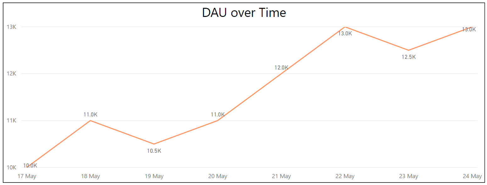

# Daily Active Users, DAU

__Daily Active Users (DAUs)__ is the number of unique users that start at least one session in your app on any given day. DAU is a high level metric about the usage of your game over time. 

## End Result

 A DAU count is a snapshot of time, for example on 17/05/2017 a game has 10,000 DAU. [date, count]

| Date         | Count          |
| -------------|:--------------:|
| 17/05/2017   | 10,000         |
 
 It is important to report DAU over time to see the progression of your game, for example the table below

| Date         | Count          |
| -------------|:--------------:|
| 17/05/2017   | 10,000         |
| 18/05/2017   | 11,000         |
| 19/05/2017   | 10,500         |
| 20/05/2017   | 11,000         |
| 21/05/2017   | 12,000         |
| 22/05/2017   | 13,000         |

